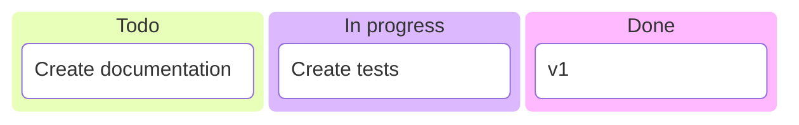

# Jackett client telegram bot

A python telegram bot for [Jackett](https://github.com/Jackett/Jackett), a torrent indexer aggregator.

### Todo

```mermaid
---
config:
---
kanban
  todo[Todo]
    docs[Create documentation]
  inProgress[In progress]
  	tests[Create tests]
  done[Done]
    v1
```